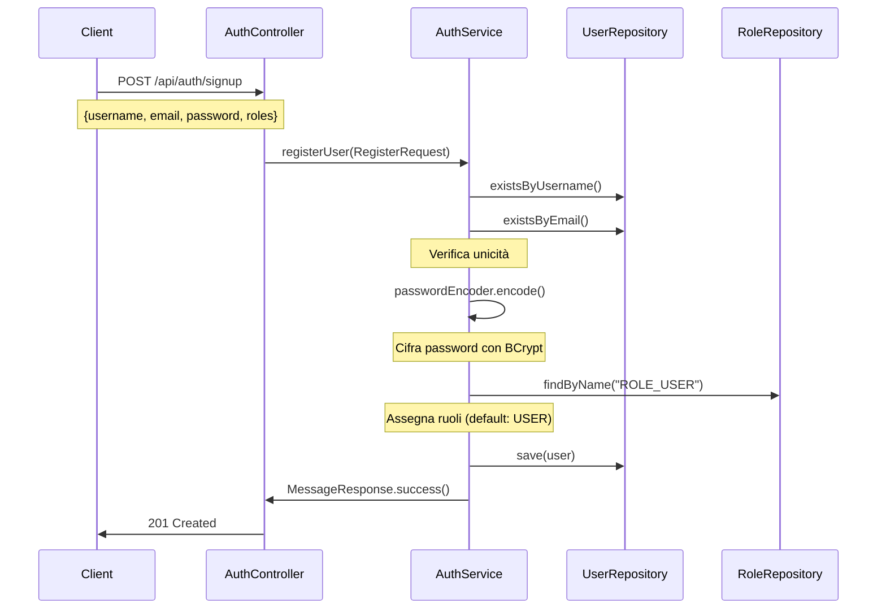
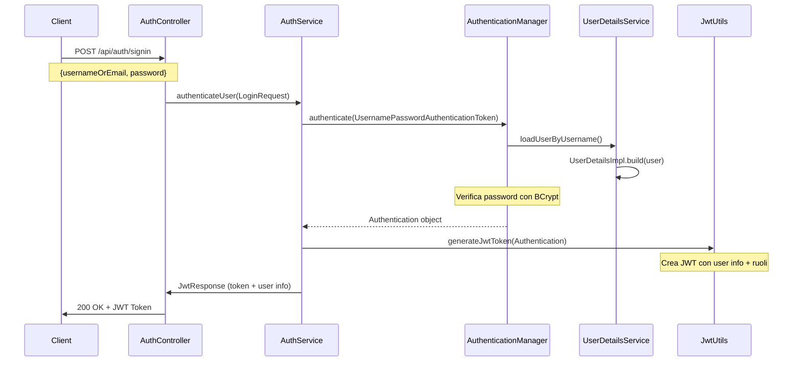
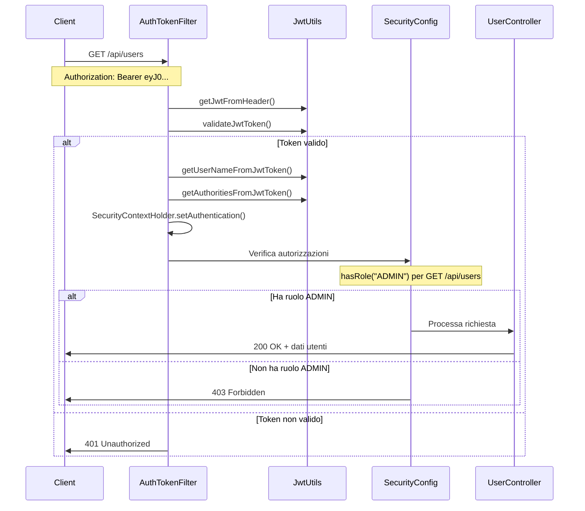

# BaseSetup Spring Security JWT

**BaseSetup** è una repository di base per progetti Java Spring Boot, pensata per essere riutilizzata come starter backend con autenticazione JWT, gestione utenti e ruoli, sicurezza avanzata e API documentate.

## 📋 Indice

- [Caratteristiche](#caratteristiche)
- [Architettura JWT](#architettura-jwt)
- [Come funziona il JWT](#come-funziona-il-jwt)
- [UserDetailsImpl e Gestione Utenti](#userdetailsimpl-e-gestione-utenti)
- [Sistema di Ruoli e Autorizzazioni](#sistema-di-ruoli-e-autorizzazioni)
- [Flusso di Autenticazione Completo](#flusso-di-autenticazione-completo)
- [Configurazione Security](#configurazione-security)
- [Endpoints API](#endpoints-api)
- [Quick Start](#quick-start)
- [Configurazione](#configurazione)
- [Estensioni](#estensioni)

## 🚀 Caratteristiche

- **Spring Boot 3.5+** con Maven
- **Autenticazione JWT stateless** completamente configurata
- **Sistema di ruoli gerarchico** (USER, ADMIN, MODERATOR)
- **Registrazione e login sicuri** con validazione
- **Password cifrate con BCrypt**
- **CORS configurato** per sviluppo e produzione
- **Swagger/OpenAPI** per documentazione API
- **Gestione errori strutturata** con risposte JSON
- **Filtri JWT personalizzati** per sicurezza avanzata

## 🔐 Architettura JWT

### Componenti Principali

```
┌─────────────────┐    ┌──────────────────┐    ┌─────────────────┐
│   Frontend      │    │   AuthController │    │   AuthService   │
│                 │───▶│                  │───▶│                 │
│ (React/Angular) │    │ /api/auth/*      │    │ Business Logic  │
└─────────────────┘    └──────────────────┘    └─────────────────┘
                                │                        │
                                ▼                        ▼
┌─────────────────┐    ┌──────────────────┐    ┌─────────────────┐
│  JWT Token      │    │  SecurityConfig  │    │  UserRepository │
│                 │◀───│                  │    │                 │
│ Bearer eyJ0...  │    │ Filter Chain     │    │ Database Access │
└─────────────────┘    └──────────────────┘    └─────────────────┘
```

### Flusso dei Filtri

```
HTTP Request → CORS → AuthTokenFilter → SecurityFilterChain → Controller
                ↓            ↓                    ↓
        Allow Origins   Extract JWT      Check Permissions
                       Validate Token    Set Authentication
                       Set Context      Grant/Deny Access
```

## 🎯 Come funziona il JWT

### 1. Generazione del Token

```java
// JwtUtils.generateJwtToken()
{
  "sub": "username",           // Subject (username)
  "id": 123,                   // User ID
  "email": "user@example.com", // Email
  "firstName": "Mario",        // Nome
  "lastName": "Rossi",         // Cognome
  "authorities": [             // Ruoli e permessi
    "ROLE_USER",
    "ROLE_ADMIN"
  ],
  "iat": 1640995200,          // Issued at
  "exp": 1641081600           // Expiration
}
```

### 2. Struttura del Token JWT

Un JWT è composto da 3 parti separate da punti:

```
eyJhbGciOiJIUzI1NiJ9.eyJzdWIiOiJ1c2VybmFtZSIsImlkIjoxMjN9.signature
│                     │                                    │
│                     │                                    └─ Signature (HMAC SHA256)
│                     └─ Payload (Base64 encoded JSON)
└─ Header (Base64 encoded)
```

### 3. Validazione e Estrazione

```java
// Il filtro AuthTokenFilter intercetta ogni richiesta
public class AuthTokenFilter extends OncePerRequestFilter {
    
    @Override
    protected void doFilterInternal(HttpServletRequest request, 
                                   HttpServletResponse response,
                                   FilterChain filterChain) {
        
        // 1. Estrai token dall'header Authorization
        String jwt = parseJwt(request); // "Bearer eyJ0..." → "eyJ0..."
        
        // 2. Valida il token
        if (jwt != null && jwtUtils.validateJwtToken(jwt)) {
            
            // 3. Estrai username e authorities
            String username = jwtUtils.getUserNameFromJwtToken(jwt);
            Collection<GrantedAuthority> authorities = 
                jwtUtils.getAuthoritiesFromJwtToken(jwt);
            
            // 4. Crea oggetto Authentication
            UsernamePasswordAuthenticationToken authentication = 
                new UsernamePasswordAuthenticationToken(username, null, authorities);
            
            // 5. Imposta nel SecurityContext
            SecurityContextHolder.getContext().setAuthentication(authentication);
        }
        
        filterChain.doFilter(request, response);
    }
}
```

### 4. Metodi Chiave di JwtUtils

| Metodo | Descrizione | Utilizzo |
|--------|-------------|----------|
| `generateJwtToken(Authentication)` | Genera JWT dal login | Dopo autenticazione riuscita |
| `generateTokenFromUser(UserDetailsImpl)` | Genera JWT da utente | Per refresh token |
| `validateJwtToken(String)` | Valida firma e scadenza | Ad ogni richiesta protetta |
| `getUserNameFromJwtToken(String)` | Estrae username | Per identificare l'utente |
| `getAuthoritiesFromJwtToken(String)` | Estrae ruoli | Per controllo autorizzazioni |
| `isTokenExpired(String)` | Verifica scadenza | Per gestione refresh |

## 👤 UserDetailsImpl e Gestione Utenti

### UserDetailsImpl: Il Ponte tra Entity e Security

`UserDetailsImpl` implementa l'interfaccia `UserDetails` di Spring Security e fa da tramite tra la nostra entità `Utente` e il sistema di autenticazione.

```java
public class UserDetailsImpl implements UserDetails {
    
    private Long id;                    // ID unico dell'utente
    private String username;            // Username per il login
    private String email;               // Email (alternativa al username)
    private String firstName;           // Nome
    private String lastName;            // Cognome
    private String password;            // Password cifrata (non esposta in JSON)
    
    // Flag di stato account Spring Security
    private boolean enabled;            // Account attivo/disattivato
    private boolean accountNonExpired;  // Account non scaduto
    private boolean accountNonLocked;   // Account non bloccato
    private boolean credentialsNonExpired; // Credenziali non scadute
    
    private Collection<? extends GrantedAuthority> authorities; // Ruoli e permessi
}
```

### Metodo Factory Build

```java
public static UserDetailsImpl build(Utente user) {
    // Converte i ruoli dell'entità in GrantedAuthority
    List<GrantedAuthority> authorities = user.getRoles().stream()
            .map(role -> new SimpleGrantedAuthority(role.getName())) // "ROLE_USER"
            .collect(Collectors.toList());

    return new UserDetailsImpl(
            user.getId(),
            user.getUsername(),
            user.getEmail(),
            user.getFirstName(),
            user.getLastName(),
            user.getPassword(),
            user.getEnabled(),           // true/false
            user.getAccountNonExpired(), // true/false
            user.getAccountNonLocked(),  // true/false
            user.getCredentialsNonExpired(), // true/false
            authorities                  // Lista di ruoli
    );
}
```

### UserDetailsServiceImpl: Caricamento Utenti

```java
@Service
public class UserDetailsServiceImpl implements UserDetailsService {
    
    @Override
    public UserDetails loadUserByUsername(String usernameOrEmail) {
        // 1. Cerca utente per username O email
        Utente user = userRepository.findByUsernameOrEmail(usernameOrEmail)
                .orElseThrow(() -> new UsernameNotFoundException("User not found"));
        
        // 2. Verifica che l'account sia attivo
        if (!user.getEnabled()) {
            throw new UsernameNotFoundException("Account disabled");
        }
        
        // 3. Converte Entity in UserDetails
        return UserDetailsImpl.build(user);
    }
}
```

## 🛡️ Sistema di Ruoli e Autorizzazioni

### Gerarchia dei Ruoli

```
ROLE_ADMIN
    ├── Può fare tutto
    ├── Gestire tutti gli utenti
    ├── Creare/eliminare utenti
    └── Accesso a tutti gli endpoint

ROLE_MODERATOR
    ├── Gestione contenuti
    ├── Moderazione utenti
    └── Endpoint specifici

ROLE_USER
    ├── Accesso base
    ├── Gestione proprio profilo
    └── Endpoint pubblici autenticati
```

### Configurazione Autorizzazioni in SecurityConfig

```java
.authorizeHttpRequests(auth -> auth
    // 🟢 Endpoint PUBBLICI - Nessuna autenticazione
    .requestMatchers("/api/auth/**")).permitAll()
    .requestMatchers("/swagger-ui/**").permitAll()
    .requestMatchers("/actuator/health").permitAll()
    
    // 🔵 Endpoint per UTENTI AUTENTICATI
    .requestMatchers("/api/utentes/**").hasRole("USER")  // Solo ROLE_USER+
    
    // 🟡 Endpoint per ADMIN
    .requestMatchers(HttpMethod.POST, "/api/users").hasRole("ADMIN")
    .requestMatchers(HttpMethod.DELETE, "/api/users/**").hasRole("ADMIN")
    .requestMatchers(HttpMethod.GET, "/api/users").hasRole("ADMIN")
    
    // 🟠 Endpoint MISTI
    .requestMatchers(HttpMethod.GET, "/api/users/**").authenticated()    // Tutti autenticati
    .requestMatchers(HttpMethod.PUT, "/api/users/**").authenticated()    // Tutti autenticati
    
    // 🔴 Tutto il resto richiede autenticazione
    .anyRequest().authenticated()
)
```

### Assegnazione Ruoli in Registrazione

```java
// AuthServiceImpl.registerUser()
Set<String> strRoles = signUpRequest.getRoles(); // ["admin", "user"]
Set<Role> roles = new HashSet<>();

if (strRoles == null || strRoles.isEmpty()) {
    // 🔵 Ruolo DEFAULT
    Role userRole = roleRepository.findByName("ROLE_USER")
            .orElseThrow(() -> new RuntimeException("Role not found"));
    roles.add(userRole);
} else {
    strRoles.forEach(role -> {
        switch (role.toLowerCase()) {
            case "admin":
                // 🟡 Admin role
                Role adminRole = roleRepository.findByName("ROLE_ADMIN").orElseThrow();
                roles.add(adminRole);
                break;
            case "mod":
                // 🟠 Moderator role  
                Role modRole = roleRepository.findByName("ROLE_MODERATOR").orElseThrow();
                roles.add(modRole);
                break;
            default:
                // 🔵 Default USER role
                Role userRole = roleRepository.findByName("ROLE_USER").orElseThrow();
                roles.add(userRole);
        }
    });
}

user.setRoles(roles); // Assegna i ruoli all'utente
```

## 🔄 Flusso di Autenticazione Completo

### 1. 📝 Registrazione (`POST /api/auth/signup`)



### 2. 🔐 Login (`POST /api/auth/signin`)



### 3. 🔒 Richiesta Protetta (`GET /api/users`)



## ⚙️ Configurazione Security

### SecurityConfig - Punti Chiave

```java
@Configuration
@EnableWebSecurity
@EnableMethodSecurity(prePostEnabled = true)  // Abilita @PreAuthorize
public class SecurityConfig {
    
    @Bean
    public SecurityFilterChain securityFilterChain(HttpSecurity http) {
        return http
            .cors(cors -> cors.configurationSource(corsConfigurationSource()))
            .csrf(AbstractHttpConfigurer::disable)  // Disabilita CSRF per API REST
            .sessionManagement(session -> 
                session.sessionCreationPolicy(SessionCreationPolicy.STATELESS)) // JWT = stateless
            .exceptionHandling(exception ->
                exception.authenticationEntryPoint(unauthorizedHandler)) // Gestione errori 401
            .authorizeHttpRequests(auth -> auth
                // Configurazione endpoint...
            )
            .addFilterBefore(authTokenFilter, UsernamePasswordAuthenticationFilter.class)
            .build();
    }
}
```

### CORS Configuration

```java
@Bean
public CorsConfigurationSource corsConfigurationSource() {
    CorsConfiguration configuration = new CorsConfiguration();
    
    // 🌐 Domini consentiti
    configuration.setAllowedOrigins(Arrays.asList(
        "http://localhost:3000",    // React dev
        "http://localhost:4200",    // Angular dev  
        "https://yourdomain.com"    // Produzione
    ));
    
    // 📡 Metodi HTTP consentiti
    configuration.setAllowedMethods(Arrays.asList(
        "GET", "POST", "PUT", "DELETE", "OPTIONS", "PATCH"
    ));
    
    // 📋 Headers consentiti
    configuration.setAllowedHeaders(List.of("*"));
    
    // 🍪 Consenti credenziali (cookies, auth headers)
    configuration.setAllowCredentials(true);
    
    return source;
}
```

## 📡 Endpoints API

### Autenticazione

| Endpoint | Metodo | Descrizione | Accesso | Request Body |
|----------|--------|-------------|---------|--------------|
| `/api/auth/signin` | POST | Login utente | 🟢 Pubblico | `LoginRequest` |
| `/api/auth/signup` | POST | Registrazione | 🟢 Pubblico | `RegisterRequest` |

### Gestione Utenti

| Endpoint | Metodo | Descrizione | Accesso | Ruolo Richiesto |
|----------|--------|-------------|---------|-----------------|
| `/api/users` | GET | Lista utenti | 🟡 Protetto | `ROLE_ADMIN` |
| `/api/users` | POST | Crea utente | 🟡 Protetto | `ROLE_ADMIN` |
| `/api/users/{id}` | DELETE | Elimina utente | 🟡 Protetto | `ROLE_ADMIN` |
| `/api/users/{id}` | GET | Dettaglio utente | 🔵 Protetto | Autenticato |
| `/api/users/{id}` | PUT | Aggiorna utente | 🔵 Protetto | Autenticato |
| `/api/utentes/**` | * | Endpoint utenti | 🔵 Protetto | `ROLE_USER` |

### Pubblici

| Endpoint | Metodo | Descrizione | Accesso |
|----------|--------|-------------|---------|
| `/swagger-ui.html` | GET | Documentazione API | 🟢 Pubblico |
| `/actuator/health` | GET | Health check | 🟢 Pubblico |

## 🚀 Quick Start

### 1. Clone e Setup

```bash
git clone <repository-url>
cd basesetup
```

### 2. Configurazione Database

```properties
# src/main/resources/application.properties

# Database Configuration
spring.datasource.url=jdbc:mysql://localhost:3306/basesetup_db
spring.datasource.username=your_username
spring.datasource.password=your_password

# JWT Configuration  
spring.app.jwtSecret=mySecretKey
spring.app.jwtExpirationMs=86400000

# JPA Configuration
spring.jpa.hibernate.ddl-auto=update
spring.jpa.show-sql=true
```

### 3. Inserimento Ruoli Iniziali

```sql
-- Inserisci i ruoli di base
INSERT INTO roles (name) VALUES ('ROLE_USER');
INSERT INTO roles (name) VALUES ('ROLE_ADMIN'); 
INSERT INTO roles (name) VALUES ('ROLE_MODERATOR');
```

### 4. Avvio Applicazione

```bash
mvn spring-boot:run
```

### 5. Test con curl

```bash
# Registrazione
curl -X POST http://localhost:8080/api/auth/signup \
  -H "Content-Type: application/json" \
  -d '{
    "username": "testuser",
    "email": "test@example.com", 
    "password": "password123",
    "firstName": "Test",
    "lastName": "User",
    "roles": ["user"]
  }'

# Login
curl -X POST http://localhost:8080/api/auth/signin \
  -H "Content-Type: application/json" \
  -d '{
    "usernameOrEmail": "testuser",
    "password": "password123"
  }'

# Richiesta protetta (sostituisci YOUR_JWT_TOKEN)
curl -X GET http://localhost:8080/api/users/1 \
  -H "Authorization: Bearer YOUR_JWT_TOKEN"
```

## 🔧 Configurazione

### Variabili Environment (Produzione)

```bash
# JWT Secret (generato casualmente)
SPRING_APP_JWT_SECRET=your-256-bit-secret-key-here

# Database
SPRING_DATASOURCE_URL=jdbc:mysql://db-host:3306/prod_db
SPRING_DATASOURCE_USERNAME=prod_user
SPRING_DATASOURCE_PASSWORD=secure_password

# CORS Origins  
CORS_ALLOWED_ORIGINS=https://yourdomain.com,https://app.yourdomain.com
```

### Personalizzazione Security

```java
// Per aggiungere nuovi endpoint protetti
.requestMatchers("/api/custom/**").hasRole("CUSTOM_ROLE")

// Per endpoint che richiedono ruoli multipli
.requestMatchers("/api/admin/**").hasAnyRole("ADMIN", "SUPER_ADMIN")

// Per endpoint con logica custom
.requestMatchers("/api/profile/**").access("@authService.canAccessProfile(authentication, #id)")
```

## 🔧 Estensioni

### 1. Refresh Token

```java
// Aggiungi in AuthController
@PostMapping("/refresh")
public ResponseEntity<JwtResponse> refreshToken(@RequestParam String username) {
    JwtResponse response = authService.refreshToken(username);
    return ResponseEntity.ok(response);
}
```

### 2. Password Reset

```java
// Nuovo endpoint per reset password
@PostMapping("/forgot-password")
public ResponseEntity<MessageResponse> forgotPassword(@RequestParam String email) {
    // Implementa logica di invio email
    return ResponseEntity.ok(MessageResponse.success("Reset email sent"));
}
```

### 3. Ruoli Personalizzati

```java
// Aggiungi nuovi ruoli in RoleName enum
public enum RoleName {
    ROLE_USER,
    ROLE_ADMIN, 
    ROLE_MODERATOR,
    ROLE_PREMIUM_USER,    // Nuovo ruolo
    ROLE_CONTENT_CREATOR  // Nuovo ruolo
}
```

### 4. Audit Logging

```java
// Aggiungi listener per tracciare operazioni
@EventListener
public void handleAuthentication(AuthenticationSuccessEvent event) {
    log.info("User {} logged in successfully", event.getAuthentication().getName());
}
```

---

## 📚 Dipendenze Principali

```xml
<dependencies>
    <!-- Spring Boot Starters -->
    <dependency>
        <groupId>org.springframework.boot</groupId>
        <artifactId>spring-boot-starter-web</artifactId>
    </dependency>
    <dependency>
        <groupId>org.springframework.boot</groupId>
        <artifactId>spring-boot-starter-security</artifactId>
    </dependency>
    <dependency>
        <groupId>org.springframework.boot</groupId>  
        <artifactId>spring-boot-starter-data-jpa</artifactId>
    </dependency>
    
    <!-- JWT -->
    <dependency>
        <groupId>io.jsonwebtoken</groupId>
        <artifactId>jjwt-api</artifactId>
        <version>0.11.5</version>
    </dependency>
    
    <!-- Database -->
    <dependency>
        <groupId>mysql</groupId>
        <artifactId>mysql-connector-java</artifactId>
    </dependency>
    
    <!-- Utilities -->
    <dependency>
        <groupId>org.projectlombok</groupId>
        <artifactId>lombok</artifactId>
    </dependency>
</dependencies>
```

---

**🎉 Il tuo backend Spring Security con JWT è pronto! Sicuro, scalabile e facilmente estendibile per qualsiasi progetto.**